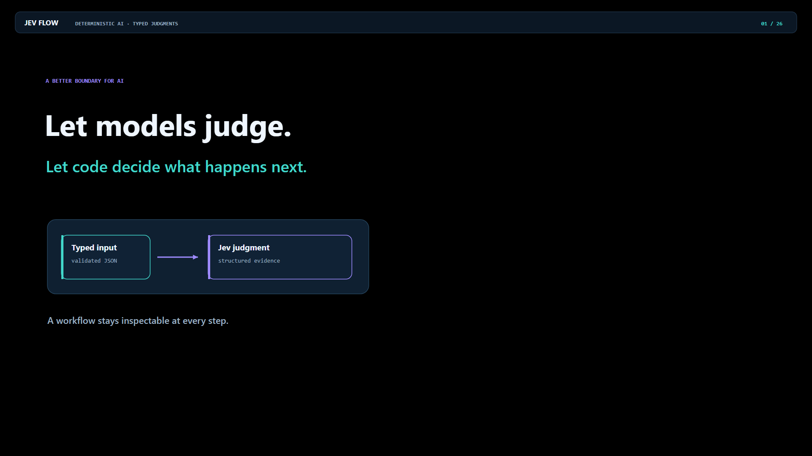
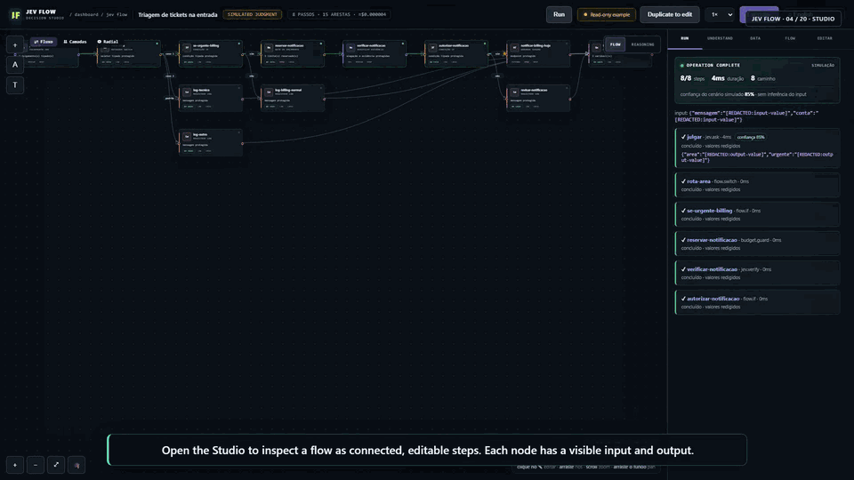
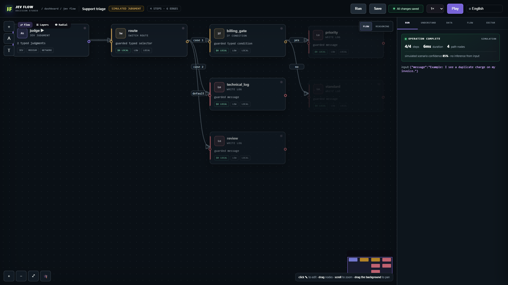
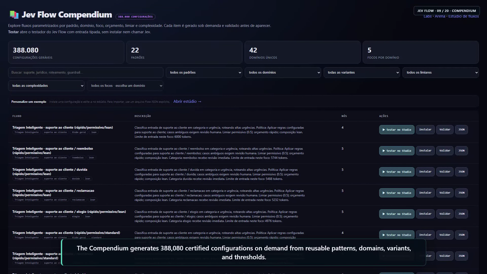
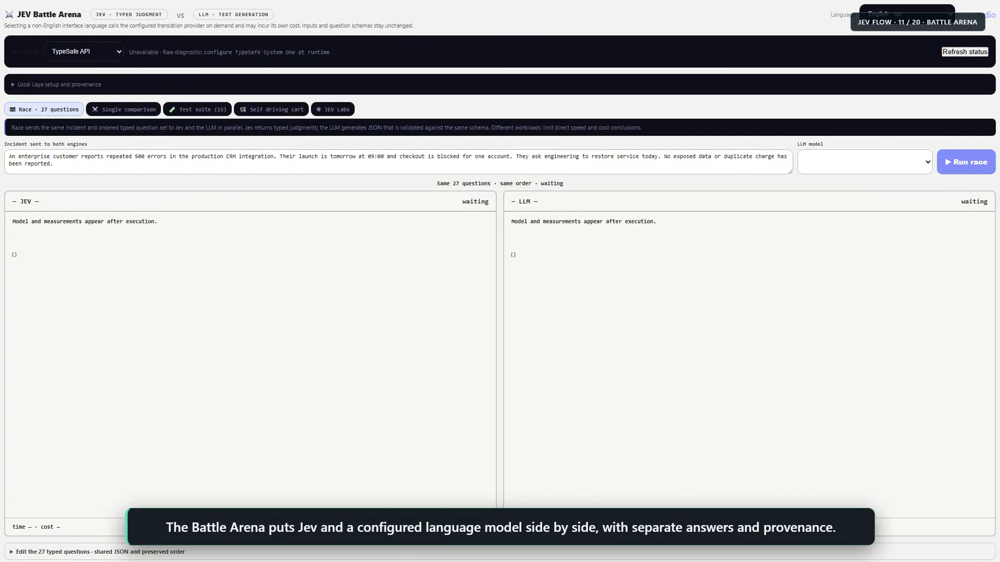
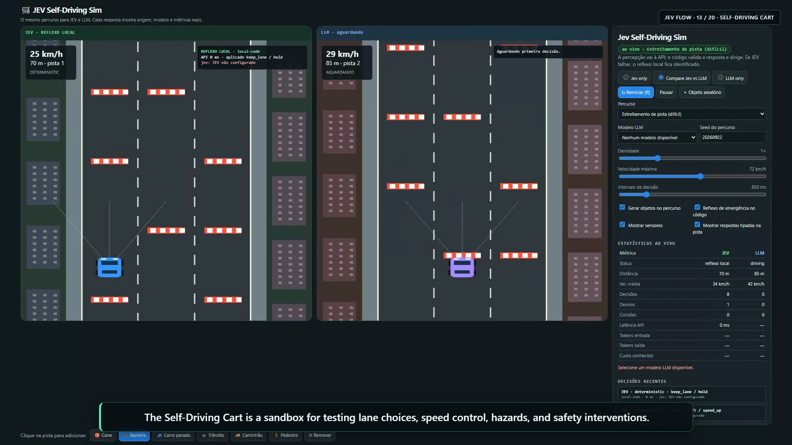
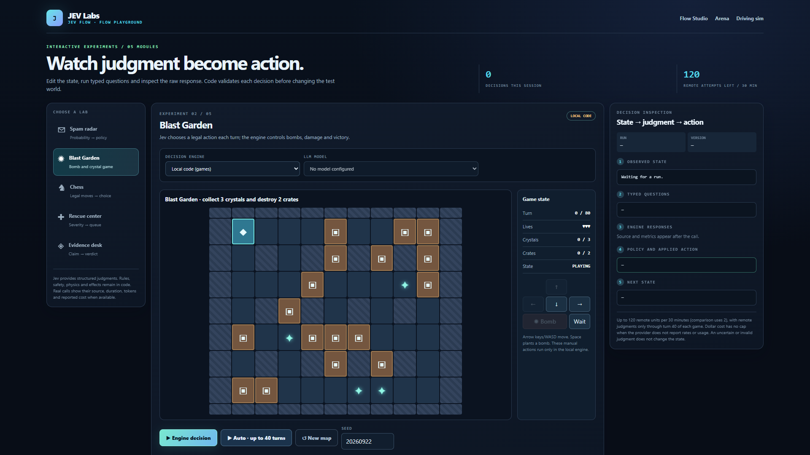
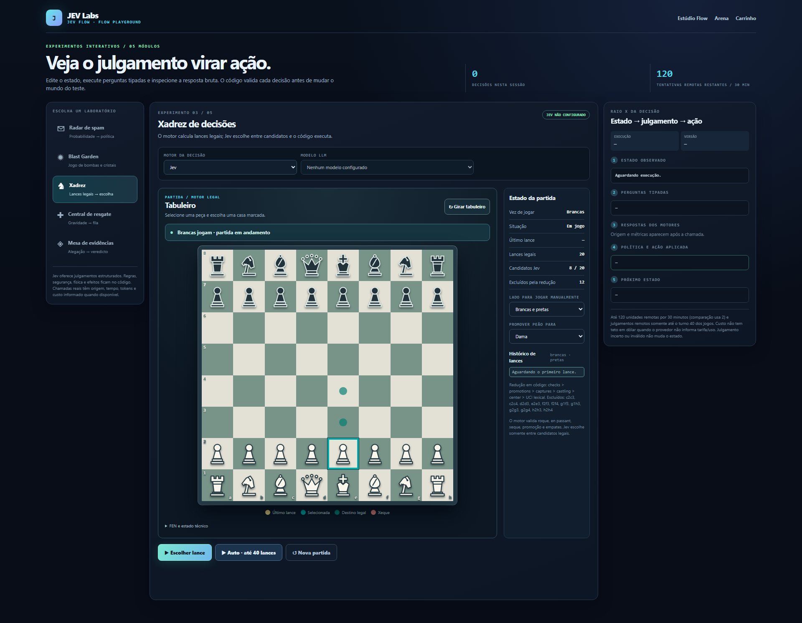

# Jev Flow

**Repository guide:** [English](README.md) · [Português (Brasil)](README.pt-BR.md). **Public guide:** [English](https://jevflow.cloud/) · [Português](https://jevflow.cloud/pt-BR/) · [Español](https://jevflow.cloud/es/) · [Français](https://jevflow.cloud/fr/) · [Deutsch](https://jevflow.cloud/de/).

Jev Flow is a standalone Node.js application for building and testing workflows with typed Jev judgments and code-owned decisions. The repository includes the Studio, generated Compendium, Battle Arena, Self-Driving Cart simulation, Ship Pack, live fixture suite, interactive games, prompt/context tools, webhook and subflow nodes, local examples, tests, and an English narrated walkthrough. The [public product guide](https://jevflow.cloud/) has real captures and a playable walkthrough; the application itself runs locally or behind your own protected deployment. The public guide does not host the server or execute a model call.

The public guide is hosted at [jevflow.cloud](https://jevflow.cloud/). Use a local or protected Node deployment for the application.

## Watch: deterministic AI and Jev Flow

[](media/jev-flow-deterministic-ai-explainer-en.webm)

[Play the 4:53 two-voice explainer](media/jev-flow-deterministic-ai-explainer-en.webm) · [English WebVTT captions](media/jev-flow-deterministic-ai-explainer-en.vtt) · [Exact spoken transcript](media/jev-flow-deterministic-ai-explainer-en-transcript.md)

The explainer uses 26 alternating Gemini 3.1 Flash TTS turns (Charon and Kore). It introduces deterministic workflow design, Jev's typed judgments, optional local Laya, then walks through the standalone Studio and other product surfaces. The support example is synthetic and uses fixed typed answers; the video does not claim a live Jev or LLM run. Captions contain only the English dialogue.

[](media/jev-flow-walkthrough.webm)

The GIF is a short preview. [Download the full WebM](media/jev-flow-walkthrough.webm), [read the English captions](media/jev-flow-walkthrough.vtt), or [inspect the transcript and demo provenance](media/jev-flow-walkthrough-transcript.md). The [public guide](https://jevflow.cloud/#watch) provides a video player; repository Markdown links to the file. The recording uses synthetic fixtures and local rules. It does not claim a live remote Jev or LLM run.

## Run locally

Requirements: Node.js 20 or later. Python is optional and is used only for a separately installed local Laya adapter.

```sh
git clone https://github.com/daltonrpj/jev-flow.git
cd jev-flow
npm ci
npm start
```

Open **http://127.0.0.1:8723/**. The root redirects to the Studio. You can import an editable flow from [`examples/`](examples/), run its synthetic fixture, and inspect routing without a credential or model call. User flows, history, schedules, rulesets, and usage logs live in the operating system's Jev Flow data directory outside this checkout. Set `JEVFLOW_DATA_DIR` to move it. See the [quickstart](docs/quickstart.md) for the routes and first run.

| Surface | Local route | What it shows | Limit |
| --- | --- | --- | --- |
| Studio | `/jev/flows` | Editable typed flows, input schema, deterministic preview, trace, and explicit live runs | A fixture demonstrates routing for supplied answers, not model accuracy. |
| Compendium | `/jev/flows/compendium` | Search, test, and install lazily generated configurations | 388,080 is a certified configuration count, not executed model runs. |
| Battle Arena | `/jev/battle` | Jev and LLM questions, answers, source, measured latency, and reported usage | Comparison claims require comparable, observed answers. |
| Self-Driving Cart | `/jev/carrinho` | Two simulated tracks, decisions, safety interventions, and provenance | The simulation is not evidence of real-world driving safety. |
| Labs | `/jev/labs` | Spam, evidence, rescue, chess, and Blast Garden exercises | Local rules and model proposals are identified separately. |
| Ship Pack | `/jev/ship` | Ten packaged Jevlets, eleven typed gates, synthetic inputs, and local decision metadata | A packaged definition is not a live certification. |
| Ship Test Suite | `/jev/suite` | 12 scenarios and 52 synthetic cases with a live-run baseline | Fixture score is not general model accuracy; incomplete or injected runs are excluded. |
| Games | `/jev/games` | Tic-Tac-Toe, fictional combat, and JevFlow City | Local mode is deterministic; live Jev requires an explicit click. |

## Real application captures

These six independent captures show the local application in English with synthetic data or local rules; unavailable providers remain visibly unavailable. The walkthrough is a separate recording with burned-in captions. No credential or private input appears in the captures. Their routes, states, dimensions, and hashes are recorded in [`media/screenshots-manifest.json`](media/screenshots-manifest.json).

**Studio —** a synthetic fixture exercises a flow and displays the resulting path.



**Compendium —** generated configurations with search, filters, and install/test actions.



**Battle Arena —** a single comparison form with an English synthetic preset before a provider run. Empty answer panes indicate that no response has been observed.



**Self-Driving Cart —** a two-track local simulation with a labeled fallback when Jev is not configured.



**Labs —** Blast Garden shows the local game state and code engine before a move.



**Chess Lab —** legal moves are calculated by the local chess engine. This capture shows a selected pawn and its legal destinations; no provider answered.



## Providers and provenance

Configure a provider only for an explicit live run. `TYPESAFE_API_KEY` selects the TypeSafe System One API for real typed judgments. The LLM adapter uses `JEVFLOW_LLM_API_KEY` or `OPENAI_API_KEY` with an explicitly selected endpoint and model. For Gemini, pair `GEMINI_API_KEY` with `JEVFLOW_LLM_BASE_URL=https://generativelanguage.googleapis.com/v1beta/openai`. Keys entered in the Studio stay in process memory and clear on restart. The optional local Laya adapter requires its own Python installation and checkpoint; Jev Flow does not bundle weights or install it on click.

| Source label | Meaning | Measurement limit |
| --- | --- | --- |
| Fixture / preview | Synthetic answer supplied for a deterministic test; no provider request | No provider latency, tokens, or remote cost. |
| Local adapter | A compatible local model actually ran | Remote billing does not apply; compute cost is not inferred. |
| Remote provider | The configured endpoint returned a schema-valid answer | Usage and price-backed cost appear only when evidence is available. |
| Unavailable / invalid | Missing key, transport failure, timeout, or malformed answer | Unknown answers and costs remain unknown; no silent provider switch. |

Jev answers are structured evidence. Flow validation and policy code own every branch and external effect. Read the [architecture](docs/architecture.md), [examples](docs/examples.md), and [security boundary](docs/security.md) before enabling webhooks.

The [Ship Pack and integrations guide](docs/ship-suite-and-integrations.md) covers CLI certification, the 52-case suite, conversational design, prompt/context APIs, webhook authentication, shared subflow budgets, and games. All runtime data remain outside this checkout.

## Catalog and tests

The Compendium combines 22 patterns, 42 unique domains, 7 variants, 4 thresholds, 3 complexity profiles, and 5 focus options into **388,080 valid generated configurations**. The total is certified against the current catalog source fingerprint and unique IDs/keys. It is not a count of hand-authored flow files or separately executed model evaluations. The certificate is in [`catalog-certification.json`](catalog-certification.json).

```sh
npm test
npm run catalog:certify -- --check
npm run site:build
```

After changing catalog source, run `npm run catalog:certify` to regenerate the manifest and root certificate. CI runs tests, verifies the certificate, and builds the public guide from an explicit asset allowlist without provider calls or deployment. The guide is released separately on the VPS; GitHub does not publish it.

## Deployment and media

The public guide is a separate static brochure. It contains only its source, six real screenshots, the walkthrough and text sidecars, generic examples, and the catalog certificate. It has no API, provider key, user data, or live application session.

The Node server binds to loopback by default. A single-tenant Ubuntu/Nginx installation may set an exact HTTPS `JEVFLOW_PUBLIC_ORIGIN` while keeping Node bound to `127.0.0.1`; Nginx must protect the **entire app**, including `/`, APIs, examples, docs, and media, with HTTP Basic Auth. The server checks the exact Host/Origin and loopback socket peer and ignores forwarded headers as authorization evidence. See the [deployment runbook](docs/deploy-hostinger.md). Do not expose the Node port publicly.

The walkthrough media and capture notes are in [`media/README.md`](media/README.md). The optional fixed-route Gemini TTS helper is documented in [`docs/walkthrough-tts.md`](docs/walkthrough-tts.md); running it requires an operator-supplied key and may incur a charge. Tests use injected transports and make no paid provider calls.
